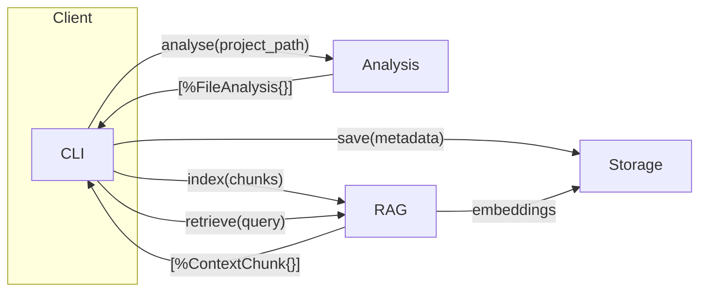
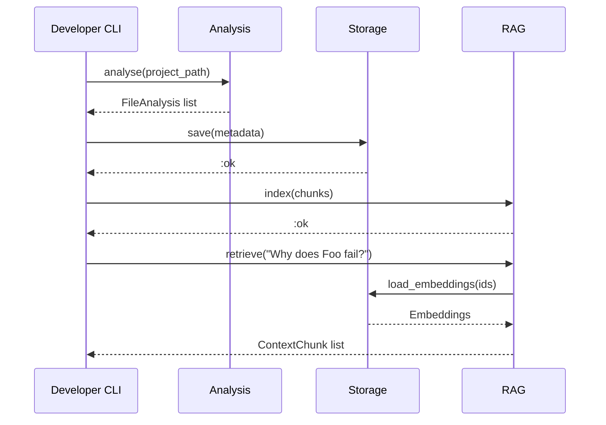

# Core Interfaces – One‑Pager (Draft)

> **Scope**: This single page defines *responsibilities*, *boundaries* and *data flow* for the three first‑class Contextus components—**Analysis**, **Storage**, and **RAG**—so that teams can work in parallel and plug in future implementations without breaking contracts.

---
## 1  Component Responsibilities

| Component | Primary Responsibilities | Explicitly *Out of Scope* |
|-----------|--------------------------|---------------------------|
| **Analysis** | • Crawl project directory 📂  \  • Parse code & build in‑memory AST/metadata  \  • Detect dependencies (imports, requires)  \  • Emit **`[%FileAnalysis{}]`** & **`[%DependencyEdge{}]`** | • Long‑term storage  \  • Embedding/vector search • UI concerns |
| **Storage** | • Persist & retrieve all analysis metadata + embeddings  \  • Provide atomic versioning / migrations  \  • Offer `save/1 • load/1 • update/1` API | • Parsing  \  • Embedding  \  • Business logic beyond CRUD |
| **RAG** | • Chunk & embed code/metadata  \  • Index vectors & run similarity search  \  • Return ranked **`[%ContextChunk{}]`**  \  • Provide `index/1 • retrieve/1` API | • File crawling  \  • Persistence (beyond calling Storage)  \  • UI rendering |

---
## 2  Boundaries & Data Flow



---
## 3  Interaction Sequence (Happy Path)



---
## 4  Shared Types (first cut)

```elixir
defmodule Contextus.Core.Types do
  @type file_path :: String.t()

  defstruct FileAnalysis: [
    path: file_path(),
    language: atom(),
    symbols: list(),
    dependencies: list()
  ]

  defstruct DependencyEdge: [
    from: file_path(),
    to: file_path(),
    type: :import | :alias | :require
  ]

  defstruct ContextChunk: [
    id: binary(),
    content: String.t(),
    score: float(),
    origin: file_path()
  ]
end
```

---
## 5  Non‑Goals / Deferred
- Network RPC between components (single‑node only for now).
- Multi‑tenant auth & ACL (Epic 10).
- Telemetry/tracing beyond debug logs.

---
## 6  Open Questions
1. Do we version the behaviours (`@behaviour_version`) or rely on SemVer tags?
2. Will Storage guarantee ACID with SQLite or eventual consistency with ETS + snapshot?
3. RAG: embed locally (e.g. `sentence-transformers`) or call external API? 1st milestone chooses local for privacy.

---
## 7  Repository Scaffold for Task 1
Below is a **suggested file/tree layout** that should exist *after* Task 1 is merged. Only stubs/no‑op implementations are required; deeper logic belongs to later tasks.

```text
contextus/
├── README.md                # Quick‑start & interface overview
├── docs/
│   └── core_interfaces_one_pager.md   # ← this doc
├── lib/
│   └── contextus/
│       └── core/
│           ├── types.ex               # Shared structs & type specs
│           ├── analysis/
│           │   ├── behaviour.ex       # @callback analyse/1
│           │   └── noop_analysis.ex   # Reference stub (logs + placeholder)
│           ├── storage/
│           │   ├── behaviour.ex       # @callback save/1, load/1
│           │   └── in_memory_storage.ex # Stub holding ETS map
│           ├── rag/
│           │   ├── behaviour.ex       # @callback index/1, retrieve/1
│           │   └── noop_rag.ex        # Returns [] on retrieve/1
│           └── core.ex                # Facade: run(project_path)
├── test/
│   └── contextus/
│       └── core/
│           ├── analysis_test.exs      # Mox mock & boundary tests
│           ├── storage_test.exs
│           └── rag_test.exs
├── mix.exs                   # Project definition & deps
└── .github/
    └── workflows/
        └── ci.yml            # Lint, dialyzer & test matrix
```

> **Notes**
> * `behaviour.ex` files declare the public contracts; naming keeps paths predictable (`Contextus.Core.Analysis`, etc.).
> * `noop_*` modules *implement* behaviours, emit debug logs, and allow end‑to‑end wiring.
> * `core.ex` orchestrates Analysis → Storage → RAG; later tasks will inject real adapters.
> * Tests rely on [`mox`](https://hex.pm/packages/mox) for mocking behaviours and verifying boundary isolation.
> * CI workflow runs `mix format --check`, `mix dialyzer`, and `mix test` on each push.

---
### Next Action
Sign‑off this draft ➜ then implement Tasks 2‑12.

